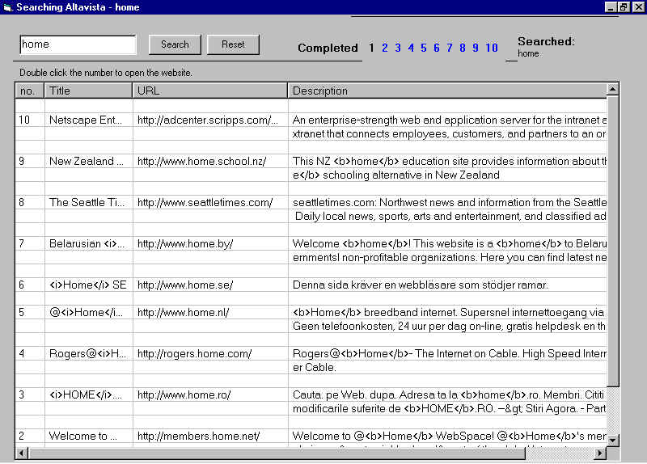

## Put altaVista search results in a listview

### Description

This code Searches AltaVista.com and puts the results into a listview. The your can click any result and it is opened in the default browser.Please put your comments down, and if you find any bugs pls put then down too. :)
 
### More Info
 

             |
---                |---
**Submitted On**   |2001-02-17 00:03:18
**By**             |[James L](https://github.com/Planet-Source-Code/PSCIndex/blob/master/ByAuthor/james-l.md)
**Level**          |Intermediate
**User Rating**    |5.0 (15 globes from 3 users)
**Compatibility**  |VB 3\.0, VB 4\.0 \(16\-bit\), VB 4\.0 \(32\-bit\), VB 5\.0, VB 6\.0
**Category**       |[String Manipulation](https://github.com/Planet-Source-Code/PSCIndex/blob/master/ByCategory/string-manipulation__1-5.md)
**World**          |[Visual Basic](https://github.com/Planet-Source-Code/PSCIndex/blob/master/ByWorld/visual-basic.md)
**Archive File**   |[Put altaVi188004242001\.zip](https://github.com/Planet-Source-Code/james-l-put-altavista-search-results-in-a-listview__1-22672/archive/master.zip)

